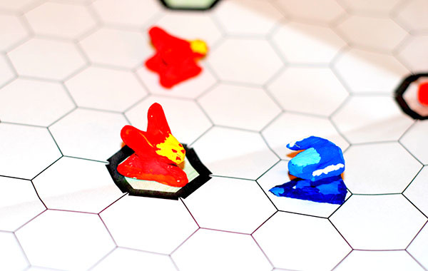

# Walki Robotow

Walki robotów to karcianka wykorzystująca podstawy programowania bez komputera.

Gra przeznaczona dla od 1 do 3 graczy.

Celem każdego z graczy jest rpzeprowadzenie dwóch robotów z jednej bazy do drugiej bazy (zaznaczone tym samym kolorem), zatrzymując się po drodze na jednym z pól spcjalnych na których mozna otrzymać dodatkowe diamenty.

Podczas każdej rundy gracze otrzymują karty - fragmenty programów. Mogą te fragmenty składać w instrukcje sterujące opisujące jak będą poruszały się roboty. Tworzenie programów wymaga opanowania prostego języka zapisu programów.

